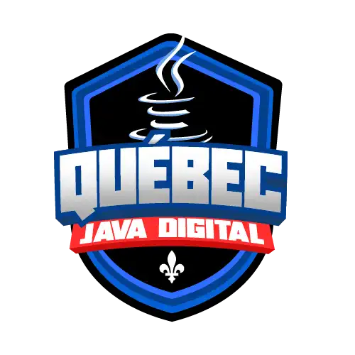

<h1 align="center">
  Bootcamp Québec Java Ditigal
</h1>

<h2 align="center">
  
</h2>

  <a href="#-projeto">🖥️ Projeto</a>&nbsp;&nbsp;&nbsp;|&nbsp;&nbsp;&nbsp;
  <a href="#-tecnologias">🚀 Tecnologias</a>&nbsp;&nbsp;&nbsp;|&nbsp;&nbsp;&nbsp;
  <a href="#-license">📝 License</a>

## 💻 Projeto

Repositório criado para os 2 desafios de códigos do bootcamp Québec Java Ditigal da DIO.

## 🚀 Tecnologias

- Java

## 📝 License

Esse projeto está sob a licença MIT. Veja o arquivo [LICENSE](LICENSE) para mais detalhes.

---

## 📚 Lista dos Desafios

### Desafios de Códigos - Desafios de Código Básico Java - Québec

- [Arrays Pares](./DesafioBasico1/App.java)
- [Cálculo Simples](./DesafioBasico2/Problema.java)
- [Preenchimento de Vetor II](./DesafioBasico3/PreenchimentoDeVetor.java)

### Desafios de Códigos - Desafios de Código Intermediário Java - Québec

- [Reduzindo um número a zero](./DesafioIntermediario1/ReduzindoNumeroAZero.java)
- [Robô](./DesafioIntermediario2/Robo.java)
- [Contando números pares](./DesafioIntermediario3/ContandoNumerosPares.java)

---
